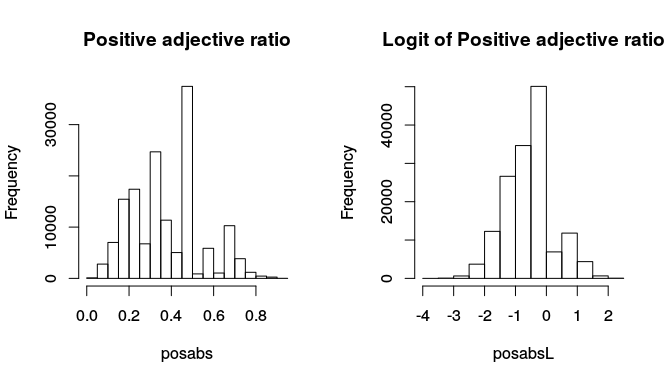
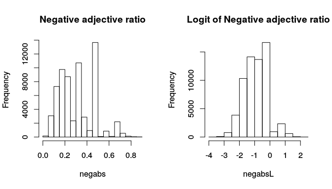
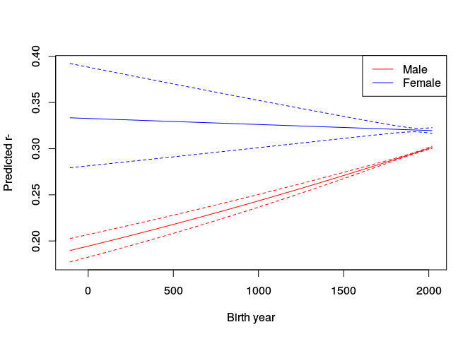
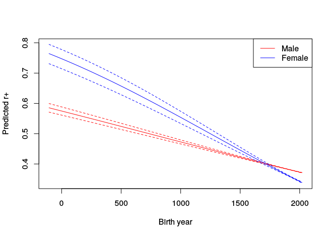
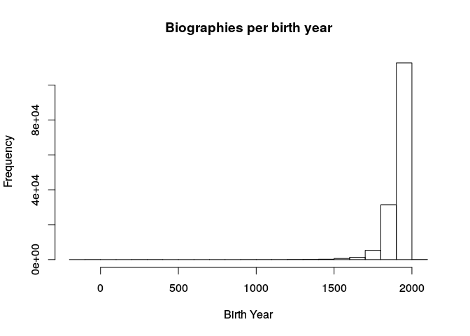

# Linguistic Intergroup Bias in Wikipedia
David Garcia  
February 25, 2016  

## Composing the Wikipedia Abstracts dataset

1. Abstracts and genders from Wikipedia.
Women Through the Glass Ceiling: Gender Asymmetries in Wikipedia. Claudia Wagner, Eduardo Graells-Garrido, David Garcia

https://github.com/clauwag/WikipediaGenderInequality/blob/master/data/person_text_1.csv.gz


```python
import urllib
urllib.urlretrieve ("https://github.com/clauwag/WikipediaGenderInequality/blob/master/data/person_text_1.csv.gz?raw=true", "person_text_1.csv.gz")
urllib.urlretrieve ("https://github.com/clauwag/WikipediaGenderInequality/blob/master/data/person_text_2.csv.gz?raw=true", "person_text_2.csv.gz")
urllib.urlretrieve ("https://github.com/clauwag/WikipediaGenderInequality/blob/master/data/person_text_3.csv.gz?raw=true", "person_text_3.csv.gz")
urllib.urlretrieve ("https://github.com/clauwag/WikipediaGenderInequality/blob/master/data/person_text_4.csv.gz?raw=true", "person_text_4.csv.gz")
```

2. MPQA subjectivity lexicon
Theresa Wilson, Janyce Wiebe, and Paul Hoffmann (2005). Recognizing Contextual Polarity in Phrase-Level Sentiment Analysis. Proc. of HLT-EMNLP-2005. 
Distributed under GPL: http://www.gnu.org/licenses/gpl.html
http://mpqa.cs.pitt.edu/lexicons/subj_lexicon/


```python
import zipfile
import urllib
#urllib.urlretrieve ("http://mpqa.cs.pitt.edu/data/subjectivity_clues_hltemnlp05.zip", "subjectivity_clues_hltemnlp05.zip")
with zipfile.ZipFile("subjectivity_clues_hltemnlp05.zip", "r") as z:
    z.extractall("subjectivity_clues")
```
                    
                    

```python
import csv
import gzip
import nltk
from nltk.tag import pos_tag, map_tag

#load subjectivity dictionary
fin = open("subjectivity_clues/subjectivity_clues_hltemnlp05/subjclueslen1-HLTEMNLP05.tff","rt")
subjdic = dict()
for line in fin:
  fields = line.split(" ")
  contdic = dict()
  for field in fields:
    parts = field.split("=")
    if len(parts) == 2:
      contdic[parts[0]] = parts[1]
  w = contdic["word1"]
  subjdic[w] = contdic["type"], contdic["pos1"], contdic["priorpolarity"].replace("\n", "")
fin.close()

fout = open("textData.dat", "w")
fout.write("class" + "\t" + "year" + "\t"+ "gender" + "\t" + "nwords" + "\t" + "nadj" + "\t" + "npos" + "\t" + "nposadj" + "\t" + "nneg" + "\t" + "nnegadj" + "\n") 

for i in range(1,5):
  with gzip.open("person_text_"+str(i)+".csv.gz") as f:
    csvreader = csv.reader(f, delimiter=',', quotechar='"')
    for fields in csvreader:
      gender = fields[3]
      if fields[3] != "gender":
        jobclass = fields[2].replace("http://dbpedia.org/ontology/", "")
        year = fields[7]
        text = fields[12].decode("utf8").replace("\n", "").replace('"', '')

        texttokens = nltk.word_tokenize(text) #Tokenize into words
        posTagged = pos_tag(texttokens)
        simplifiedTags = [(word, map_tag('en-ptb', 'universal', tag)) for word, tag in posTagged] #Parts-Of-Speech tagging to detect adjectives
        nadj = nwords =  0
        npos = nneg = 0
        nposadj = nnegadj = 0

        for tag in simplifiedTags :
          if tag[1] != ".":
            nwords +=1
            word = tag[0].lower()
            
            sv = subjdic.get(word, -1)
            polarity = ""
            if sv != -1:
              polarity = sv[2]
            
            if tag[1] == "ADJ":
              nadj +=1
            if polarity == "positive":
              npos +=1
              if tag[1] == "ADJ":
                nposadj +=1
            if polarity == "negative":
              nneg +=1
              if tag[1] == "ADJ":
                nnegadj +=1
            if polarity == "both":
              npos +=1
              nneg +=1
              if tag[1] == "ADJ":
                nposadj +=1
                nnegadj +=1

        fout.write(jobclass  + "\t" + year  + "\t" +  gender + "\t" + str(nwords) + "\t" + str(nadj) + "\t" + str(npos) + "\t" + str(nposadj) + "\t" + str(nneg) + "\t" + str(nnegadj) + "\n") 

```


# Chi-squared tests of general proportions


```r
library(xtable)
library(texreg)
df <- read.table("textData.dat", sep="\t", header=TRUE)
attach(df)

prop.test( c(sum(nposadj[gender=="male"]),sum(nposadj[gender=="female"])), c(sum(npos[gender=="male"]), sum(npos[gender=="female"])), alternative="greater")
```

```
## 
## 	2-sample test for equality of proportions with continuity
## 	correction
## 
## data:  c(sum(nposadj[gender == "male"]), sum(nposadj[gender == "female"])) out of c(sum(npos[gender == "male"]), sum(npos[gender == "female"]))
## X-squared = 1409.6, df = 1, p-value < 2.2e-16
## alternative hypothesis: greater
## 95 percent confidence interval:
##  0.02936179 1.00000000
## sample estimates:
##    prop 1    prop 2 
## 0.3074918 0.2768128
```

```r
# Effect size calculation
p0 <- sum(nposadj)/sum(npos)
p1 <- sum(nposadj[gender=="male"])/sum(npos[gender=="male"])
p2 <- sum(nposadj[gender=="female"])/sum(npos[gender=="female"])
print(paste("Cohen's W:", sqrt(((p0-p1)^2 + (p0-p2)^2)/p0)))
```

```
## [1] "Cohen's W: 0.0476818769010449"
```

```r
print(paste("% Change:", (p1-p2)/p1 * 100))
```

```
## [1] "% Change: 9.97719384705178"
```

```r
prop.test( c(sum(nnegadj[gender=="male"]),sum(nnegadj[gender=="female"])), c(sum(nneg[gender=="male"]), sum(nneg[gender=="female"])), alternative="less")
```

```
## 
## 	2-sample test for equality of proportions with continuity
## 	correction
## 
## data:  c(sum(nnegadj[gender == "male"]), sum(nnegadj[gender == "female"])) out of c(sum(nneg[gender == "male"]), sum(nneg[gender == "female"]))
## X-squared = 54.482, df = 1, p-value = 7.844e-14
## alternative hypothesis: less
## 95 percent confidence interval:
##  -1.00000000 -0.00536268
## sample estimates:
##    prop 1    prop 2 
## 0.1611854 0.1681139
```

```r
# Effect size calculation
p0 <- sum(nnegadj)/sum(nneg)
p1 <- sum(nnegadj[gender=="male"])/sum(nneg[gender=="male"])
p2 <- sum(nnegadj[gender=="female"])/sum(nneg[gender=="female"])
print(paste("Cohen's W:", sqrt(((p0-p1)^2 + (p0-p2)^2)/p0)))
```

```
## [1] "Cohen's W: 0.0151218374209077"
```

```r
print(paste("% Change:", (p1-p2)/p1 * 100))
```

```
## [1] "% Change: -4.2984631068513"
```


# Does abstraction depend on the gender of the biography?


```r
library(xtable)
library(texreg)
df <- read.table("textData.dat", sep="\t", header=TRUE)
attach(df)
```

```
## The following objects are masked from df (pos = 3):
## 
##     class, gender, nadj, nneg, nnegadj, npos, nposadj, nwords,
##     year
```

```r
minW <- 50
f <- npos>0 & !is.na(year) & nwords >=minW & nposadj != npos & nposadj >0
posabs <- (nposadj/npos)[f]
posabsL <- log(posabs/(1-posabs))

par(mfrow=c(1,2))
hist(posabs, main="Positive adjective ratio")
hist(posabsL, main="Logit of Positive adjective ratio")
```



Logit models for the ratios:

$logit(r_+) = a_+ + b_+*\delta_F $

$logit(r_-) = a_- + b_-*\delta_F$ 

(we expect $b_+<0$ and $b_- >0$)


```r
G <- rep(0,sum(f))
G[gender[f] == "female"] <- 1
linModel <- glm(posabsL~G)

htmlreg(list(linModel), digits=4, single.row=TRUE, bold=0.05)
```


<table cellspacing="0" align="center" style="border: none;">
<caption align="bottom" style="margin-top:0.3em;">Statistical models</caption>
<tr>
<th style="text-align: left; border-top: 2px solid black; border-bottom: 1px solid black; padding-right: 12px;"></th>
<th style="text-align: left; border-top: 2px solid black; border-bottom: 1px solid black; padding-right: 12px;"><b>Model 1</b></th>
</tr>
<tr>
<td style="padding-right: 12px; border: none;">(Intercept)</td>
<td style="padding-right: 12px; border: none;"><b>-0.4848</b> (0.0022)<sup style="vertical-align: 0px;">***</sup></td>
</tr>
<tr>
<td style="padding-right: 12px; border: none;">G</td>
<td style="padding-right: 12px; border: none;"><b>-0.1149</b> (0.0058)<sup style="vertical-align: 0px;">***</sup></td>
</tr>
<tr>
<td style="border-top: 1px solid black;">AIC</td>
<td style="border-top: 1px solid black;">360112.7680</td>
</tr>
<tr>
<td style="padding-right: 12px; border: none;">BIC</td>
<td style="padding-right: 12px; border: none;">360142.5585</td>
</tr>
<tr>
<td style="padding-right: 12px; border: none;">Log Likelihood</td>
<td style="padding-right: 12px; border: none;">-180053.3840</td>
</tr>
<tr>
<td style="padding-right: 12px; border: none;">Deviance</td>
<td style="padding-right: 12px; border: none;">95310.4640</td>
</tr>
<tr>
<td style="border-bottom: 2px solid black;">Num. obs.</td>
<td style="border-bottom: 2px solid black;">151777</td>
</tr>
<tr>
<td style="padding-right: 12px; border: none;" colspan="2"><span style="font-size:0.8em"><sup style="vertical-align: 0px;">***</sup>p &lt; 0.001, <sup style="vertical-align: 0px;">**</sup>p &lt; 0.01, <sup style="vertical-align: 0px;">*</sup>p &lt; 0.05</span></td>
</tr>
</table>


```r
f <- nneg>0 & !is.na(year) & nwords >=minW & nnegadj != nneg & nnegadj >0
negabs <- (nnegadj/nneg)[f]
negabsL <- log(negabs/(1-negabs))

par(mfrow=c(1,2))
hist(negabs, main="Negative adjective ratio")
hist(negabsL, main="Logit of Negative adjective ratio")
```




```r
G <- rep(0,sum(f))
G[gender[f] == "female"] <- 1
linModel <- glm(negabsL~G)

htmlreg(list(linModel), digits=4, single.row=TRUE, bold=0.05)
```


<table cellspacing="0" align="center" style="border: none;">
<caption align="bottom" style="margin-top:0.3em;">Statistical models</caption>
<tr>
<th style="text-align: left; border-top: 2px solid black; border-bottom: 1px solid black; padding-right: 12px;"></th>
<th style="text-align: left; border-top: 2px solid black; border-bottom: 1px solid black; padding-right: 12px;"><b>Model 1</b></th>
</tr>
<tr>
<td style="padding-right: 12px; border: none;">(Intercept)</td>
<td style="padding-right: 12px; border: none;"><b>-0.8723</b> (0.0034)<sup style="vertical-align: 0px;">***</sup></td>
</tr>
<tr>
<td style="padding-right: 12px; border: none;">G</td>
<td style="padding-right: 12px; border: none;"><b>0.1193</b> (0.0097)<sup style="vertical-align: 0px;">***</sup></td>
</tr>
<tr>
<td style="border-top: 1px solid black;">AIC</td>
<td style="border-top: 1px solid black;">153224.3925</td>
</tr>
<tr>
<td style="padding-right: 12px; border: none;">BIC</td>
<td style="padding-right: 12px; border: none;">153251.5666</td>
</tr>
<tr>
<td style="padding-right: 12px; border: none;">Log Likelihood</td>
<td style="padding-right: 12px; border: none;">-76609.1962</td>
</tr>
<tr>
<td style="padding-right: 12px; border: none;">Deviance</td>
<td style="padding-right: 12px; border: none;">41558.3190</td>
</tr>
<tr>
<td style="border-bottom: 2px solid black;">Num. obs.</td>
<td style="border-bottom: 2px solid black;">63453</td>
</tr>
<tr>
<td style="padding-right: 12px; border: none;" colspan="2"><span style="font-size:0.8em"><sup style="vertical-align: 0px;">***</sup>p &lt; 0.001, <sup style="vertical-align: 0px;">**</sup>p &lt; 0.01, <sup style="vertical-align: 0px;">*</sup>p &lt; 0.05</span></td>
</tr>
</table>


# Do these effects depend on the year when the person was born?


```r
df <- read.table("textData.dat", sep="\t", header=TRUE)
attach(df)
```

```
## The following objects are masked from df (pos = 3):
## 
##     class, gender, nadj, nneg, nnegadj, npos, nposadj, nwords,
##     year
```

```
## The following objects are masked from df (pos = 4):
## 
##     class, gender, nadj, nneg, nnegadj, npos, nposadj, nwords,
##     year
```

```r
f <- npos>0 & !is.na(year) & nwords >=minW & nposadj != npos & nposadj >0
posabsL <- log(posabs/(1-posabs))
y <- year[f]
cor.test(posabsL, y)
```

```
## 
## 	Pearson's product-moment correlation
## 
## data:  posabsL and y
## t = -18.798, df = 151780, p-value < 2.2e-16
## alternative hypothesis: true correlation is not equal to 0
## 95 percent confidence interval:
##  -0.05321287 -0.04317444
## sample estimates:
##         cor 
## -0.04819487
```

```r
G <- rep(0,sum(f))
G[gender[f] == "female"] <- 1
posdf <- data.frame(y=y, G=G, posabsL=posabsL)
yearModelPos <- glm(posabsL~G*y, data=posdf)
```


```r
f <- nneg>0 & !is.na(year) & nwords >=minW & nnegadj != nneg & nnegadj >0
negabsL <- log(negabs/(1-negabs))
y <- year[f]
G <- rep(0,sum(f))
G[gender[f] == "female"] <- 1
cor.test(negabsL, y)
```

```
## 
## 	Pearson's product-moment correlation
## 
## data:  negabsL and y
## t = 7.6128, df = 63451, p-value = 2.709e-14
## alternative hypothesis: true correlation is not equal to 0
## 95 percent confidence interval:
##  0.02243277 0.03798014
## sample estimates:
##        cor 
## 0.03020828
```

```r
negdf <- data.frame(y=y, G=G, negabsL=negabsL)
yearModelNeg <- glm(negabsL~G*y, data=negdf)
```


```r
htmlreg(list(yearModelPos, yearModelNeg), digits=4, single.row=TRUE, bold=0.05)
```


<table cellspacing="0" align="center" style="border: none;">
<caption align="bottom" style="margin-top:0.3em;">Statistical models</caption>
<tr>
<th style="text-align: left; border-top: 2px solid black; border-bottom: 1px solid black; padding-right: 12px;"></th>
<th style="text-align: left; border-top: 2px solid black; border-bottom: 1px solid black; padding-right: 12px;"><b>Model 1</b></th>
<th style="text-align: left; border-top: 2px solid black; border-bottom: 1px solid black; padding-right: 12px;"><b>Model 2</b></th>
</tr>
<tr>
<td style="padding-right: 12px; border: none;">(Intercept)</td>
<td style="padding-right: 12px; border: none;"><b>0.3019</b> (0.0554)<sup style="vertical-align: 0px;">***</sup></td>
<td style="padding-right: 12px; border: none;"><b>-1.4215</b> (0.0782)<sup style="vertical-align: 0px;">***</sup></td>
</tr>
<tr>
<td style="padding-right: 12px; border: none;">G</td>
<td style="padding-right: 12px; border: none;"><b>0.7834</b> (0.1765)<sup style="vertical-align: 0px;">***</sup></td>
<td style="padding-right: 12px; border: none;"><b>0.7256</b> (0.2539)<sup style="vertical-align: 0px;">**</sup></td>
</tr>
<tr>
<td style="padding-right: 12px; border: none;">y</td>
<td style="padding-right: 12px; border: none;"><b>-0.0004</b> (0.0000)<sup style="vertical-align: 0px;">***</sup></td>
<td style="padding-right: 12px; border: none;"><b>0.0003</b> (0.0000)<sup style="vertical-align: 0px;">***</sup></td>
</tr>
<tr>
<td style="padding-right: 12px; border: none;">G:y</td>
<td style="padding-right: 12px; border: none;"><b>-0.0005</b> (0.0001)<sup style="vertical-align: 0px;">***</sup></td>
<td style="padding-right: 12px; border: none;"><b>-0.0003</b> (0.0001)<sup style="vertical-align: 0px;">*</sup></td>
</tr>
<tr>
<td style="border-top: 1px solid black;">AIC</td>
<td style="border-top: 1px solid black;">359813.7711</td>
<td style="border-top: 1px solid black;">153178.9104</td>
</tr>
<tr>
<td style="padding-right: 12px; border: none;">BIC</td>
<td style="padding-right: 12px; border: none;">359863.4220</td>
<td style="padding-right: 12px; border: none;">153224.2007</td>
</tr>
<tr>
<td style="padding-right: 12px; border: none;">Log Likelihood</td>
<td style="padding-right: 12px; border: none;">-179901.8856</td>
<td style="padding-right: 12px; border: none;">-76584.4552</td>
</tr>
<tr>
<td style="padding-right: 12px; border: none;">Deviance</td>
<td style="padding-right: 12px; border: none;">95120.3828</td>
<td style="padding-right: 12px; border: none;">41525.9236</td>
</tr>
<tr>
<td style="border-bottom: 2px solid black;">Num. obs.</td>
<td style="border-bottom: 2px solid black;">151777</td>
<td style="border-bottom: 2px solid black;">63453</td>
</tr>
<tr>
<td style="padding-right: 12px; border: none;" colspan="3"><span style="font-size:0.8em"><sup style="vertical-align: 0px;">***</sup>p &lt; 0.001, <sup style="vertical-align: 0px;">**</sup>p &lt; 0.01, <sup style="vertical-align: 0px;">*</sup>p &lt; 0.05</span></td>
</tr>
</table>

We visualize the interactions in the model


```r
ys <- seq(min(posdf$y), max(posdf$y))

predsMale0 <- predict(yearModelNeg, newdata= data.frame(y=ys, G=rep(0,length(ys))), se.fit=TRUE)
#Preditions for male biographies in Negative model
predsMale <- exp(predsMale0$fit)/(exp(predsMale0$fit)+1)
predsMaleLow <- exp(predsMale0$fit-predsMale0$se.fit)/(exp(predsMale0$fit-predsMale0$se.fit)+1) 
predsMaleHigh <- exp(predsMale0$fit+predsMale0$se.fit)/(exp(predsMale0$fit+predsMale0$se.fit)+1) 

predsFemale0 <- predict(yearModelNeg, newdata= data.frame(y=ys, G=rep(1,length(ys))), se.fit=TRUE)
#Preditions for female biographies in Negative model
predsFemale <- exp(predsFemale0$fit)/(exp(predsFemale0$fit)+1)
predsFemaleLow <- exp(predsFemale0$fit-predsFemale0$se.fit)/(exp(predsFemale0$fit-predsFemale0$se.fit)+1) 
predsFemaleHigh <- exp(predsFemale0$fit+predsFemale0$se.fit)/(exp(predsFemale0$fit+predsFemale0$se.fit)+1) 

plot(ys, predsMale, col="red", type="l", ylim=range(c(predsMaleHigh, predsMaleLow, predsFemaleHigh, predsFemaleLow)), xlab="Birth year", ylab="Predicted r-")
lines(ys, predsMaleLow, col="red", lty=2)
lines(ys, predsMaleHigh, col="red", lty=2)
lines(ys, predsFemale, col="blue")
lines(ys, predsFemaleLow, col="blue", lty=2)
lines(ys, predsFemaleHigh, col="blue", lty=2)
legend(c("Male", "Female"), x="topright", col=c("red", "blue"), lwd=c(1,1)) 
```




```r
predsMale0 <- predict(yearModelPos, newdata= data.frame(y=ys, G=rep(0,length(ys))), se.fit=TRUE)
#Preditions for male biographies in Positive model
predsMale <- exp(predsMale0$fit)/(exp(predsMale0$fit)+1)
predsMaleLow <- exp(predsMale0$fit-predsMale0$se.fit)/(exp(predsMale0$fit-predsMale0$se.fit)+1) 
predsMaleHigh <- exp(predsMale0$fit+predsMale0$se.fit)/(exp(predsMale0$fit+predsMale0$se.fit)+1) 

predsFemale0 <- predict(yearModelPos, newdata= data.frame(y=ys, G=rep(1,length(ys))), se.fit=TRUE)
#Preditions for female biographies in Positive model
predsFemale <- exp(predsFemale0$fit)/(exp(predsFemale0$fit)+1)
predsFemaleLow <- exp(predsFemale0$fit-predsFemale0$se.fit)/(exp(predsFemale0$fit-predsFemale0$se.fit)+1) 
predsFemaleHigh <- exp(predsFemale0$fit+predsFemale0$se.fit)/(exp(predsFemale0$fit+predsFemale0$se.fit)+1) 

plot(ys, predsMale, col="red", type="l", ylim=range(c(predsMaleHigh, predsMaleLow, predsFemaleHigh, predsFemaleLow)), xlab="Birth year", ylab="Predicted r+")
lines(ys, predsMaleLow, col="red", lty=2)
lines(ys, predsMaleHigh, col="red", lty=2)
lines(ys, predsFemale, col="blue")
lines(ys, predsFemaleLow, col="blue", lty=2)
lines(ys, predsFemaleHigh, col="blue", lty=2)
legend(c("Male", "Female"), x="topright", col=c("red", "blue"), lwd=c(1,1)) 
```




```r
hist(posdf$y, main="Biographies per birth year", xlab="Birth Year")
```




